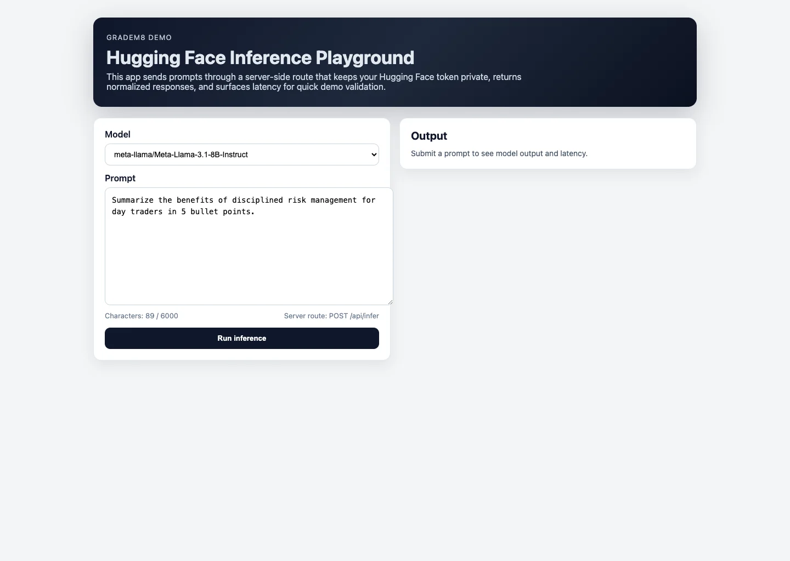
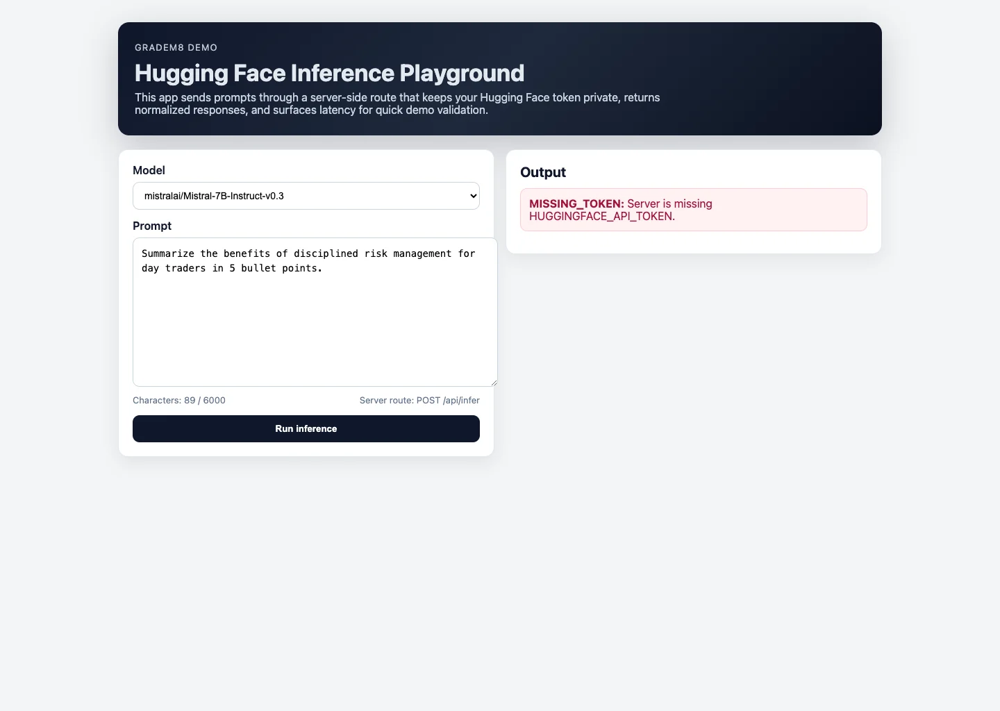

# Gradem8 HF Space 2

Canonical repository for the Gradem8 Hugging Face Space integration demo.

This project demonstrates a production-style Next.js integration with the Hugging Face Inference API using a secure server route.

## Value proposition

This demo provides a clear reference implementation for connecting product-facing UI with hosted model inference while keeping API tokens server-side.

## Screenshots





## Stack

- Next.js 14
- TypeScript
- Server-side Hugging Face inference route (`POST /api/infer`)
- Vercel deployment

## Architecture

Component and integration design notes are in [docs/architecture.md](docs/architecture.md).

## Quickstart

```bash
pnpm install
pnpm dev
```

## Deployment

Deployment prerequisites and environment setup are documented in [docs/setup.md](docs/setup.md).

## API

`POST /api/infer`

Request:

```json
{
  "prompt": "Explain risk-to-reward ratio in 4 bullets.",
  "model": "meta-llama/Meta-Llama-3.1-8B-Instruct"
}
```

Response:

```json
{
  "output": "1. ...",
  "model": "meta-llama/Meta-Llama-3.1-8B-Instruct",
  "latencyMs": 872
}
```

## Impact

Demo outcomes and practical use cases are in [docs/impact.md](docs/impact.md).

## Docs

- [Architecture](docs/architecture.md)
- [Setup](docs/setup.md)
- [Impact](docs/impact.md)

## Contact

- Email: fuaadabdullah@gmail.com
- LinkedIn: https://www.linkedin.com/in/fuaadabdullah
